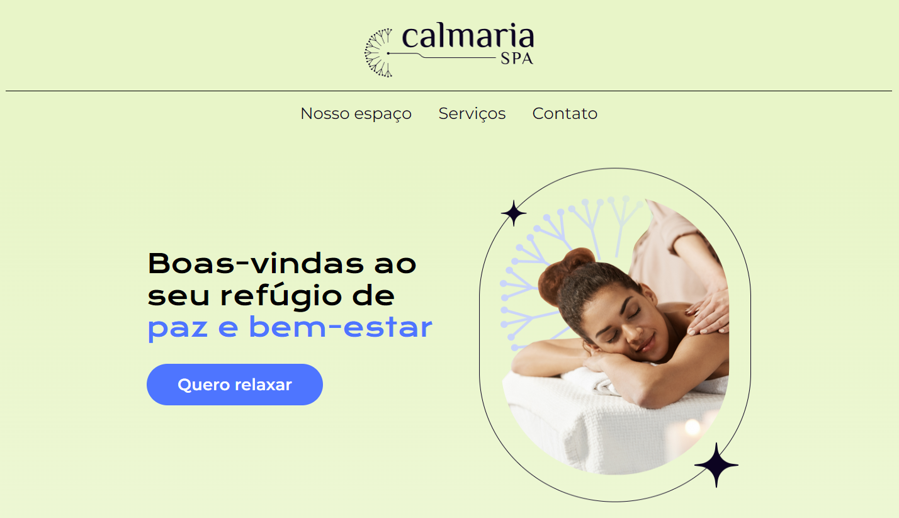

# Calmaria Spa

A Calmaria Spa é um empresa de bem estar e saúde. Nesse momento, temos o código inicial da sua landing page, onde vamos encontrar pontos de melhoria para tornar o projeto acessível a todas as pessoas usuárias.

## 🔨 Funcionalidades do projeto

Nesse primeiro momento, nós temos a página que foi idealizada como a primeira entrega do time de desenvolvimento.

Durante o projeto, nós vamos analisar e refatorar o código do projeto. 
O desafio é encontrar pontos de melhoria para tornar o projeto Calmaria Spa acessível para todas as pessoas usuárias. 

O [Figma dessa aplicação você encontra aqui](https://www.figma.com/design/ZNUoF9v6wOCY7zIH60aYCz/Calmaria-Spa--%7C-Forma%C3%A7%C3%A3o-Acessibilidade-(Copy)?node-id=98-572&t=6Q6mTObulZIqdgT0-1).

## ✔️ Técnicas e tecnologias utilizadas

Se liga nessa lista de tudo que usaremos nesse projeto:

- `HTML`
- `CSS`
- `Acessibilidade Web`
- `Figma`

E muito mais!

## 🛠️ Abrir e rodar o projeto

Para abrir e rodar o projeto, utilize um editor de código de sua escolha.

Depois, abra o projeto no seu navegador.

